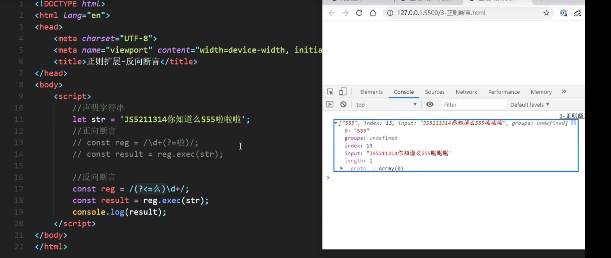
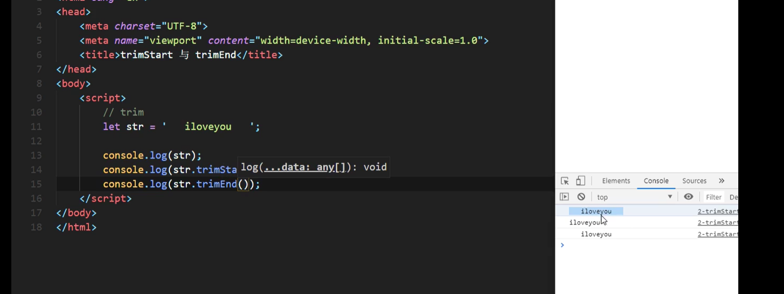

# ES6

> let介绍

> const介绍

> 变量的结构赋值

> 模板字符串

> 简化对象及方法

> 箭头函数

> 函数默认值

> rest参数

> 扩展运算符

> Symbol使用

> 迭代器

> 生成器

> Promise

> SET

> Map

> Class

> ES 数值扩展

###### Number.EPSILON

##### 二进制八进制

###### Number.isFinte

###### Number.isNan

###### Number.parseInt

###### Number.isInteger

###### Math.trunc

###### Math.sign(正值：1，零：0，负值：-1)

> ES 对象方法扩展

###### Object.is

###### Object.assign

###### Object.setPrototypeOf Object.getPrototypeOf

> 模块化介绍

# ES7

# ES8

> async & await 

> 对象方法扩展（Object.values、Object.entries和Object.getOwnPropretyDescriptors）

# ES9

> 扩展运算符与rest参数

> 正则扩展（命名捕获分组）

> 正则扩展（反向断言）

> 正则扩展dotAll模式

# ES10

> 对象扩展方法Object.fromEntries

> 字符串扩展方法trimStart和trimEnd

> 数组方法扩展 flat和flatMap

> symbol扩展symbol.prototype.description

# ES11

> 私有属性

> Promise.allSettled（结果始终都会是成功）

> 字符串扩展方法：String.prototype.matchAll

> 可选链操作符

> 动态Import

> BigInt类型

> 绝对全局对象globalThis

`始终指向当前环境的全局对象`