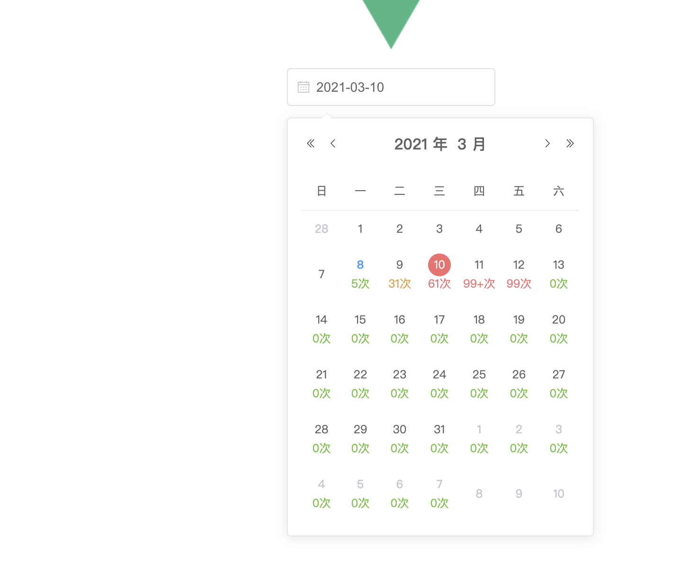

# 一个基于elementUI（datePicker）可以简单定义日期下方内容的日期控件

## 场景
```
公司业务需要，要求在日期控件下方输出一些客户的跟进（录入）次数
```

## 思路

1. 根据datePicker控件自带的属性`picker-options`>`cellClassName`通过计算来插入自定义样式
2. 然后在这些自定义样式用插入伪元素(`::after`)
3. 在伪元素中通过`content`来指定要显示的内容，从而达到预期效果（当然css的调整必不可少）


## 效果展示



### Customize configuration
See [Configuration Reference](https://cli.vuejs.org/config/).
